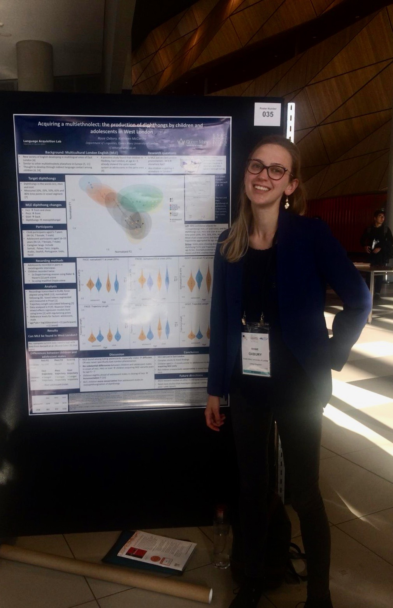

---
title: "About me"
---

Hello!

I am a PhD student at Queen Mary University of London. I am a variationist sociolinguist working on: *sociophonetics* -- specifically, changes in the diphthongs in Multicultural London English; discourse pragmatic variation and change.

You can use the tabs at the top of the page to look at my academic papers and conference presentations, and some of my R notebooks (under 'Scrapbook').
